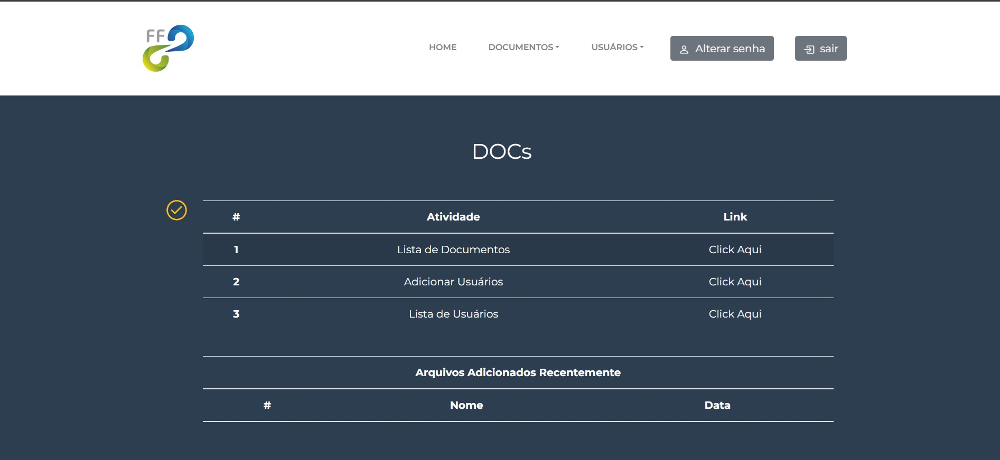
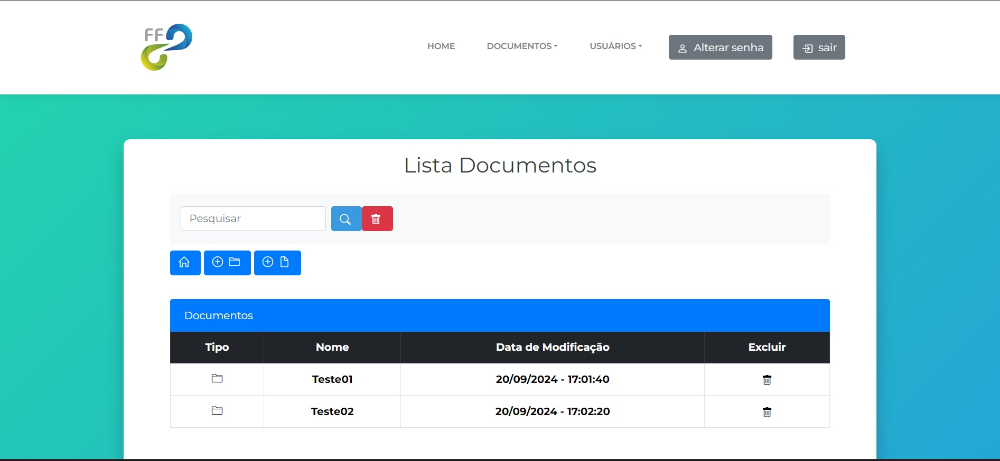
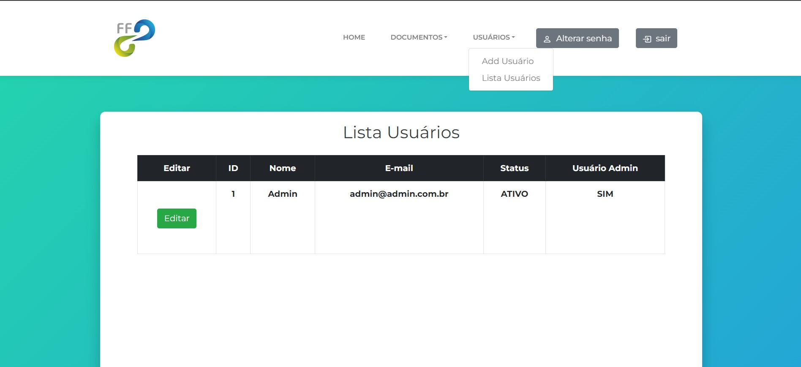
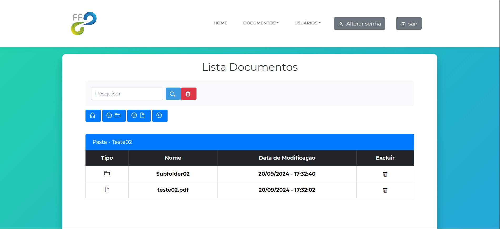

# DOCs

* Este projeto foi desenvolvido em php, html, css e mysql. Para adicionar e gerenciar documentos PDF entre acionistas.
* O sistema possui login;
* O banco de dados encontra-se na pasta mysql, com dados para teste;

## Login

* Para login de teste utilizar:
    * Usuario: admin
    * Senha: 123456

## DOCs

* Os documentos são adicionados na pasta: "docs" do projeto

## Imagens do Projeto

  

  
  
  

  